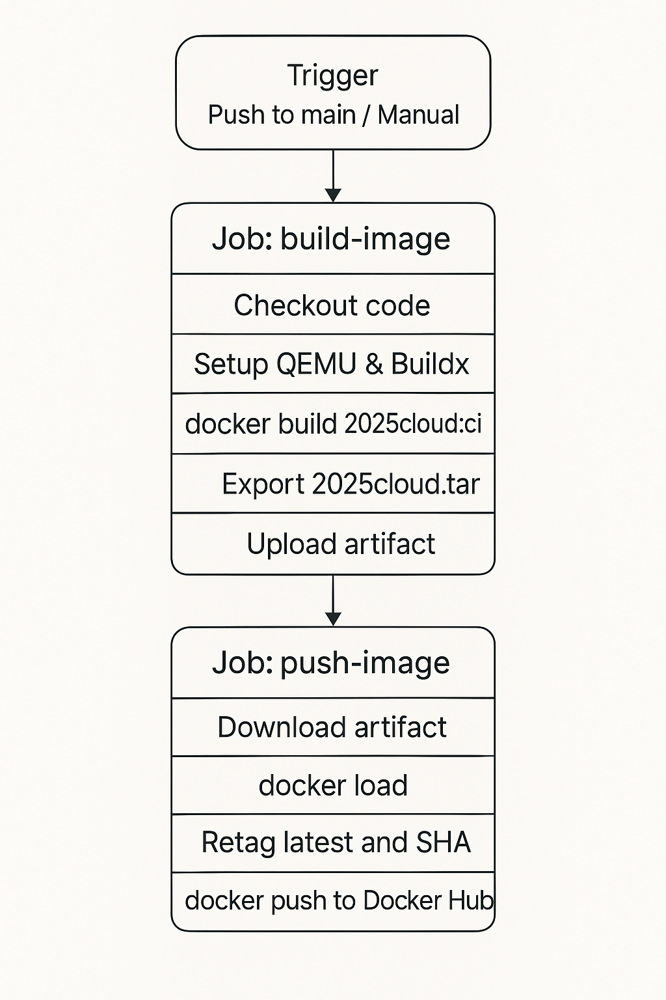

# cloud_native_hw4

## Build Docker Image

```shell
docker build -t [name_of_image] .
```

-   please replace `name_of_image` to your desired docker image name

## Run the Built Docker Image (in detached mode and expose port 3000)

```shell
docker run -dp 3000:3000 [name_of_image]
```

Other useful flags:

-   `-d`: run container in detached mode
-   `-p [host_port]:[container_port]`: expose container port to host port
-   `-i`: attach container `STDIN`
-   `-t`: attach container `STDOUT`
-   `--name [name]`: name the container
-   `--rm`: delete the container on shut down

### or directly run the image from Docker Repo

```shell
docker run -dp 3000:3000 cl1224/2025cloud
```

## How the container image is created and tagged?

1. Trigger – A push to `main` (or a manual `workflow_dispatch`) starts a single workflow run
2. `build-image` job
    - Checks out the code, sets up QEMU/Buildx, and builds the Docker image locally with the temporary tag `2025cloud:ci`
    - Instead of pushing, it exports the image as a tarball `/tmp/2025cloud.tar` and uploads it as the artifact `2025cloud-image`.
3. `push-image` job (require success from `build-image`)
    - Downloads that artifact, docker loads the tarball back into the engine.
    - Re-tags the image twice:
        - `USERNAME/2025cloud:latest`: latest image will be always from the most recent build
        - `USERNAME/2025cloud:<commit SHA>`: commit-specific image
    - Logs in with the Docker Hub secrets and docker push `--all-tags` so both tags land in your registry.


